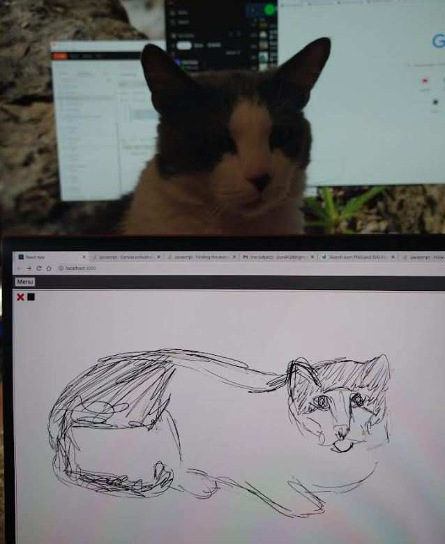

### About

This is an HTML-Canvas-based drawing app developed on a Samsung Chromebook 4K (EMR pen).

It is intended to work for capacitive pens in general but some pens/screens are better than others.

Features

- color choosing
- path saving to db

Based on this [demo code](https://stackoverflow.com/questions/2368784/draw-on-html5-canvas-using-a-mouse) from Stack Overflow

### Pressure

Uses [pressure.js](https://github.com/stuyam/pressure) to detect how hard you push down/changes stroke size

### Great artiste

### Issues

This code is problematic, specifically the variable/state handling.
