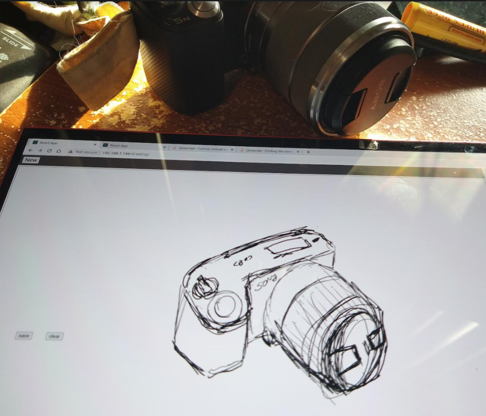

Features

Base
- [x] colors (06/15/2023)
- [ ] save

Advanced
- [ ] move canvas

06/15/2023

2:09 PM

alright back on

going to rework that body wrapper, need it for abs positioned items

2:20 PM

the canvas height is weird and it's offset again so I'm not gonna mess with this right now

need to move forward, these are personal tools so don't have to be polished long as they work

I'll add the color picker now

2:43 PM

ugh... now I have a problem where variables aren't keeping current I think it's a reference issue

can't use react state with the canvas

tried setting but the reference to the value is the initial eg. false/empty

2:52 PM

hmm... having a lot of weird broken variables where some are working, some are at initial value

3:02 PM

oof man that's nasty but got it to work

3:09 PM

ugh... gotta build this drop down interface for search... smart move is to move it outside of canvas

I will, cleaner, it is a component after all... ayeee

3:17 PM

ooh had a good idea, have a saving status indicator

I just want to comment on the side that I am super f'd financially lol

Did an interview, did great but I was also like "too advanced" in that area... I would still take the job if offered but yeah... also I probably gave off that vibe of "let's change all the existing practices" guy

Anyway yeah I'm not doing hot right now, job interviews take a while and I've sold most of my things

Actually wondering now if I will be able to pay rent next month lol... considering it used to be my rent was like 10% of my monthly income

Anyway... yeah gotta free myself

I was a dumbass for leaving the good job that I had without a plan

3:27 PM

the DOM is structured poorly here but I need to get this done/move on

3:58 PM

quick break

---

06/14/2023

1:17 PM

crap sleep again

I want to start using this thing "dog food" and part of that is an onscreen keyboard... since I think the Linux one is hard to trigger

It'll be fun too, to make a keyboard

But yeah... I keep reaching to draw on something but I sold my remarkable 2! Sad...

This has a benefit of real-time sync but RM2 is capable of that as well

Downside of a foldable laptop like this is it's janky... like keyboard/mousepad is still active with this Manjaro Arch setup I'm running.

Probably something you can configure/setup but already other problems... also using a tiny 13" screen like this is like self torture when if I look up 12" there is a 32" ultrawide monitor above it

But... I bought it/wanted the tiny sleek red laptop... so here we are

What I'm having a problem with at the moment, the SO example code works but I don't know what's the proper way to deal with fast changing states

Oh man my neck

1:33 PM

for real idk if I can work on this long term looking down at this laptop

1:40 PM

I'm having trouble seeing the design... I had a bunch of ideas yesterday but I didn't write them down

1:50 PM

Seems meta

I gotta start using it, so I can refine it

The current saving method turns it into an image so you couldn't edit it later, that's not good

1:57 PM

actually... maybe image is good enough, I just need to be able to reload it back into the canvas and then draw over it eg. white would erase

2:03 PM

skimmed this... TEXT it is

https://stackoverflow.com/questions/14042599/storing-base64-encoded-data-as-blob-or-text-datatype

2:08 PM

that works... nice

3:02 PM

wrote the API bit basic stuff, testing on postman real quick before integrating here

I will get this thing to be functional today and integrated into cross-platform-app so I can start using it

then next will be that on-screen keyboard

3:28 PM

distracted, still testing API

3:43 PM

still distracted, need to wrap up testing this API

3:49 PM

back on

3:53 PM

okay API is good, now will integrate into some kind of an interface

4:26 PM

I'm screwing around with layout sizes

4:33 PM

whoa maybe it is possible to trigger the existing virtual keyboard with JS, let me check

the only reason I'm looking into this is the jank support with arch (have to do it yourself)

4:40 PM

nah it's not working, tried it

4:45 PM

it is possible to get pressure... using pressure.js

I want the pressure so it changes the stroke size

4:56 PM

this is cool detecting the pressure

4:58 PM

the pressure value is super precise... like 15+ digits after decimal but it's between 0 and 1 so I guess I will multiply

since canvas stroke width is 0 to infinity

it's interesting it causes these orthogonal artifacts

5:12 PM

it's weird I have a caching thing going on

seems like I need to add a debouncer

5:18 PM

wtf... the code works then it doesn't work between saves

5:36 PM

I don't understand, the pressure thing works sometimes but not all the time

not sure if it's updating too fast or what

5:44 PM

okay... maybe I have it, possible it's how I was initializing it/wrong order issue

5:55 PM

I wonder what causes the gaps

It could be the speed that the pressure changes... 50ms seems good

6:13 PM

so far deployed is problematic

6:31 PM

Okay I think I have a solution, to average the strokes vs. just jumping (makes the gaps)

now my concern is memory leak... since the pressure thing fires off a lot

it's fine... CPU goes up

6:44 PM

alright this is the one...

6:48 PM

good enough to draw

I did not get as far as I would like today but the pressurejs was an extra feature and I also did the API part already

So it's mostly coming up with a UI and wiring it up to the API

9:32 PM

not satisfied with progress, he proceeds forward

I want color so I can erase

10:22 PM

I was working on a basic color picker but somehow I messed up the mouse position so it's offset vertically by 10 pixels ahhhhh

10:35 PM

dang it... have to go backwards

10:39 PM

man... I almost lost all that progress dumb

it was the addition of a body wrapper

10:44 PM

ohh... I just realized the canvas extends below the header that's why

I'll fix that tomorrow

10:48 PM

oh no I know what it is, the clientOffset selector is using parent and putting body on it... yeah moves it down

something like that
