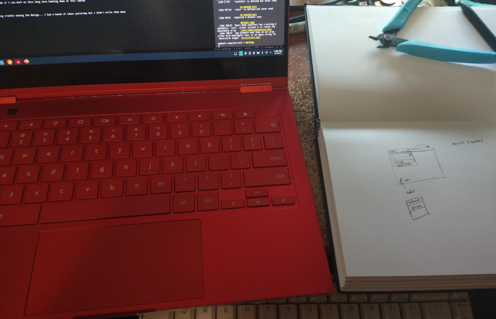

Features

Base
- [ ] colors
- [ ] save

Advanced
- [ ] move canvas

06/14/2023

1:17 PM

crap sleep again

I want to start using this thing "dog food" and part of that is an onscreen keyboard... since I think the Linux one is hard to trigger

It'll be fun too, to make a keyboard

But yeah... I keep reaching to draw on something but I sold my remarkable 2! Sad...

This has a benefit of real-time sync but RM2 is capable of that as well

Downside of a foldable laptop like this is it's janky... like keyboard/mousepad is still active with this Manjaro Arch setup I'm running.

Probably something you can configure/setup but already other problems... also using a tiny 13" screen like this is like self torture when if I look up 12" there is a 32" ultrawide monitor above it

But... I bought it/wanted the tiny sleek red laptop... so here we are

What I'm having a problem with at the moment, the SO example code works but I don't know what's the proper way to deal with fast changing states

Oh man my neck

1:33 PM

for real idk if I can work on this long term looking down at this laptop

1:40 PM

I'm having trouble seeing the design... I had a bunch of ideas yesterday but I didn't write them down

1:50 PM

Seems meta

I gotta start using it, so I can refine it

The current saving method turns it into an image so you couldn't edit it later, that's not good

1:57 PM

actually... maybe image is good enough, I just need to be able to reload it back into the canvas and then draw over it eg. white would erase

2:03 PM

skimmed this... TEXT it is

https://stackoverflow.com/questions/14042599/storing-base64-encoded-data-as-blob-or-text-datatype

2:08 PM

that works... nice
